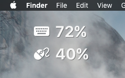

# Simple Übersicht Bluetooth Keyboard & Mouse Status Widget

See how much battery is left on your peripherals. (Only tested on the Apple bluetooth keyboard and magic mouse). Just something I put together quick. Feel free to contribute and improve.

To enable, place the `devicebatt.widget` folder in your `Übersicht/widgets` directory.

## Todo:
- Other wireless device support

Get more widgets at [Übersicht][1]!

[1]: http://tracesof.net/uebersicht-widgets/
